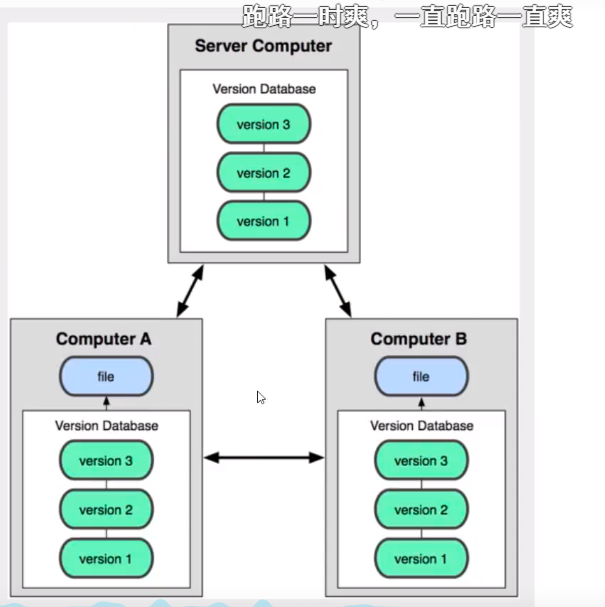
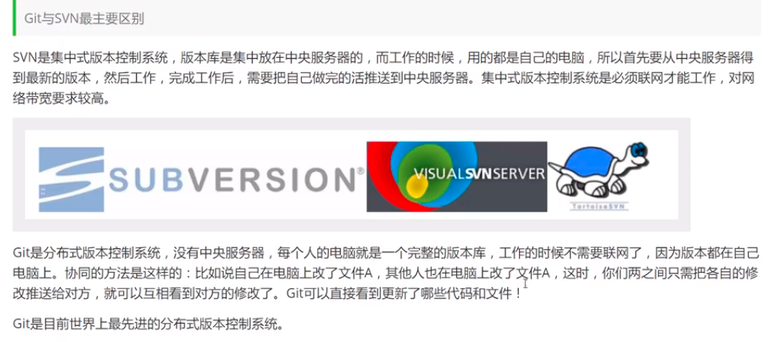
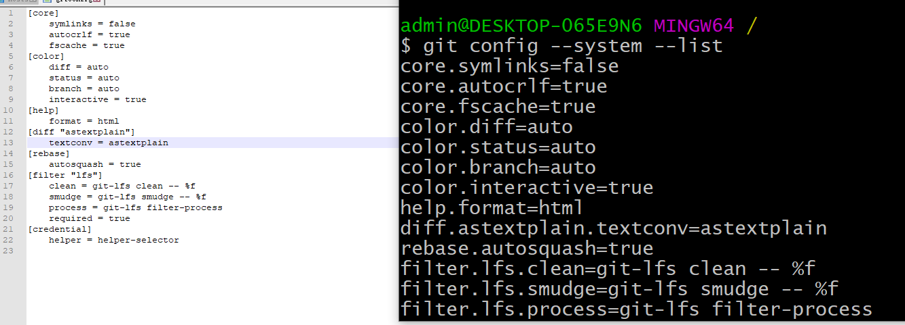
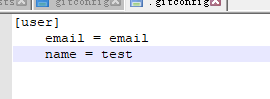
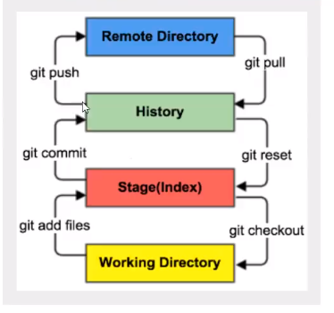
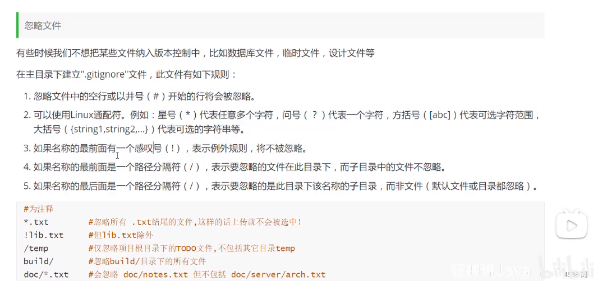
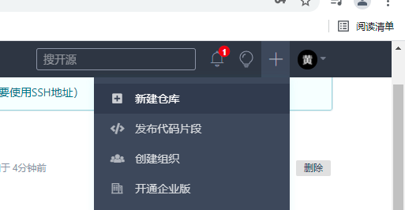
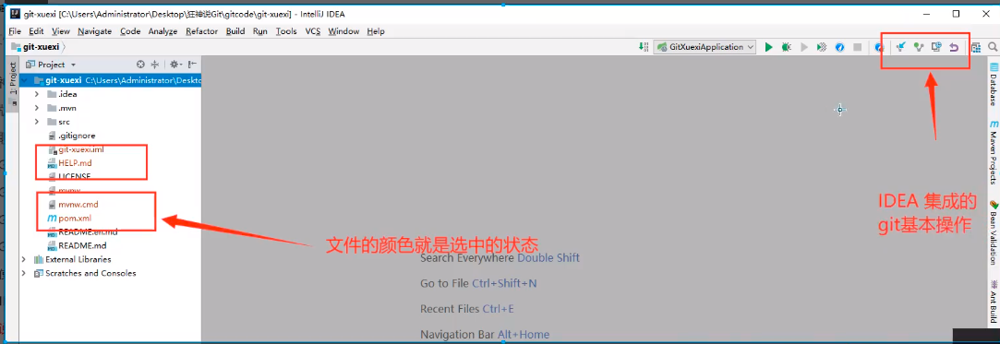
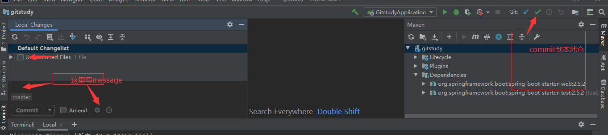

## Git学习

### 版本控制

版本迭代

需要版本控制工具

### 版本控制分类

* 本地版本控制 
* 集中版本控制**Svn**
* 分布式版本控制**Git**



### Git与Svn的主要区别



==** Git目前是世界上最先进的分布式版本控制系统**== 

### Git环境配置

> Git配置
>
> git config -l #查看全局配置
>
> git config --system --list #过滤查看系统的配置
>
> git config --global --list #本地配置的(全局配置)
>
> user.email=email
> user.name=test


git config --system --list命令里面的内容就是etc/gitconfig文件的内容




git config --global --list命令的文件在c盘\用户\admin\.gitconfig



没有配置用户名和邮箱后面就没有办法上传项目

> 

环境变量配置

D:\environment\git\PortableGit\cmd

### Git基本理论(核心)

Git本地有三个工作区域：工作目录、暂存区、资源库，如果再加上远程Git仓库就可以分为四个工作区域




### 创建本地仓库

* 第一种生成git项目的方式

```git init```

* 克隆下载项目

git clone url地址(复制ssh的地址才能做到免登录效果)

### Git 文件操作

```bash
# 查看文件指定状态
git status [fileName]
# 查看所有文件状态
git status
#添加所有文件到暂存区
git add .
#添加暂存区的文件到本地仓库
git commit -m "信息内容" # -m 提交信息
```


### 上传到远程服务器时忽略的文件




### 使用码云

> 国外github有墙，访问会比较慢，使用gitee
>
> 公司有时会自己搭建git服务器：通过gitlab,然后部署在linux上


```bash
# 设置本机绑定SSH公钥，实现免密码登录！
# 安装git之后会有.ssh文件
# 进入C:\Users\admin\.ssh
cmd命令
ssh-keygen
# ssh-keygen -t rsa                        -t 表示加密 rsa加密算法
# 将.pub的文件公钥复制到码云的ssh公钥中

```


使用码云新建一个远程仓库




### Idea集成git

1.新建项目，绑定git

将远程下载下来的git文件拷贝到项目中，替换掉同名文件



2.修改文件，使用idea操作git



3.提交测试

命令git push

提交到码云

### Git分支

**git分支常用命令 **

```bash
#列出所有本地分支
git branch

#列出所有的远程分支
git branch -r

#新建一个分支，但依然停留在当前分支
git branch dev

#新建一个分支，并切换到该分支
git checkout -b [branch]

#合并指定分支到当前分支
git merge [branch]

#删除分支
$ git branch -d [branch-name]

#删除远程分支
$ git push origin --delete [branch-name]
$ git branch -dr [remote/branch]

```


